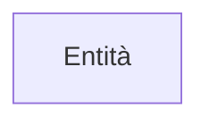
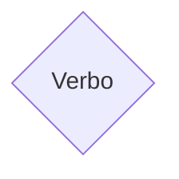
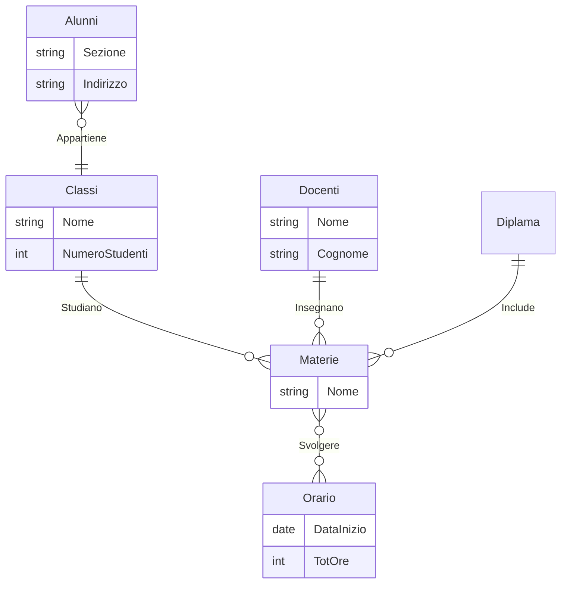
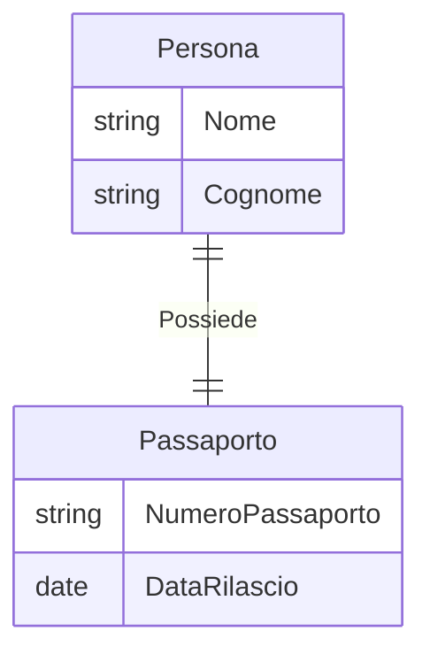
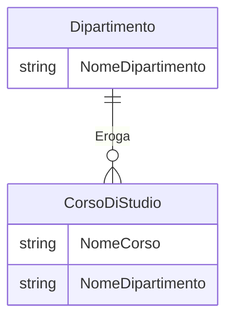
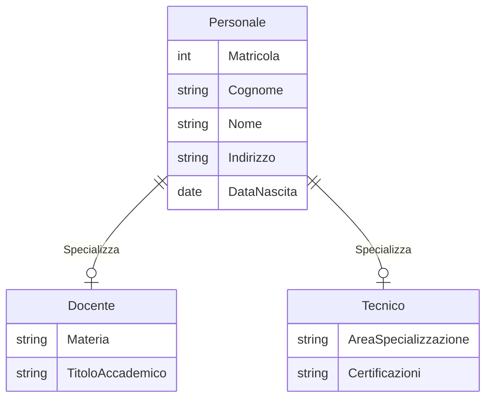

# 11° lezione database

Argomenti: Progettazione Concettuale 
Materia: Database
REVISIONATA : No
Status: Done

## Progetto della base di dati

Si hanno diversi modelli di database

- **Reticolare**
- **Generarchico**
- **Relazione**
- **Non relazione o NOSQL**

## Fasi di progettazione del DB

- **la progettazione concettuale;**
- **la progettazione logica;**
- **la progettazione fisica.**

Prima di procedere con il mopdello 

- **Progettazione concettuale**
    
    Lo scopo della progettazione concettuale  è quello di tradurre la descrizione informale della realtà, risultato dell’analisi dei requisiti del DB (tipicamente sotto forma di documenti e moduli di vario genere), in uno schema formale e completo. Da questa progettazione viene fuori  il **modello E-R** cioè un insieme di concetti e notazioni standardadatti alla rappresentazione del dominio applicativo. 
    
- **Progettazione Logica**
    
    Consiste nella traduzione dello schema concettuale in termini di un determinato modello logico (ad esempio il modello relazionale) di dati usato dal DBMS che si intende utilizzare. Il risultato è lo **schema logico**. In questa fase si ha una parte di ottimizzazione  della
    rappresentazione in funzione delle operazioni eseguite chiamata **normalizzazione**.
    
- **Progettazione Fisica**
    
    Si completa lo schema logico con la specifica dei parametri fisici di memorizzazione dei
    dati. Si produce lo schema fisico che fa riferimento ad un certo modello fisico dei dati che dipende dal DBMS scelto
    

## Modello ER

Il modello **Entità-Relazione (E-R)** è un modello concettuale di dati che
contiene alcuni costrutti atti a descrivere la realtà in maniera semplice,
indipendente dalla organizzazione dei dati nel computer.

I costrutti sono

**– Entità
– Associazioni (Relazioni)
– Proprietà (Attributi)
– Cardinalità
– Identificatori
– Generalizzazioni
– Sottoinsiemi**

## Entità e attributi

Le entità nel modello ER si rappresentano con il simbolo 

Con il pallino pieno si indica l’identificatore univoco, invece, con quello vuoto si indica un normale attributo. Gli attributi devono essere atomici cioè devono contenere una sola informazione.  

## Associazioni

Le **associazioni**  si rappresentano con i rombi e dentro questo si mette il **verbo** che lega le entità.

- $1:1$ **uno a uno**: ad un istanza di un’ entità corrisponde una di un altra entità
- $1:N$ **uno a molti**: ad un instante di un entitò corriposndono piu istanze di un altra entità
- $N:1$ **molti a uno**
- $N: N$ **molti a molti**: a due o piu instanze di un entità corrispondono due o piu istanze di un altra entità

## Proprietà delle associazioni

## Auto Associazioni

## Identificazione Esterna

Il concetto di **identificazione esterna** implica che un'entità non può essere identificata solo tramite i suoi attributi interni, ma ha bisogno di una relazione con un'altra entità. In pratica, l'entità dipende da un'altra entità per la sua identificazione(FK).

Le identificazioni esterne avvengono sempre tramite associazioni binarie in cui l’entità da identificare partecipa con cardinalità $(1,1)$

## Tipi di gerarchie

- **t sta per totale**:
    
    **ogni istanza dell’entità padre deve far parte di una delle entità figlie**
    
    
    
    Esempio:  il personale si divide (completamente) in esterni e dipendenti
    
- **nt sta per non totale**
    
    **le istanze dell’entità padre possono far parte di una delle entità figlie**
    
    Esempio: i pescatori sono un sottoinsieme dei cittadini
    
    
    
- **e sta per esclusiva:**
    
    **ogni istanza dell’entità padre deve far parte di una sola delle entità figlie**
    
    Esempio: una istanza di personale non può sia essere sia dipendente che esterno
    
    
    
- **ne sta per non esclusiva:**
    
    **ogni istanza dell’entità padre può far parte di una o più entità figlie**
    
    Esempio: un cittadino può essere sia pescatore che cacciatore
    
    
    

## Eredità delle proprietà

L'**ereditarietà delle proprietà** è un concetto utilizzato in modelli concettuali, come nei diagrammi ER, per descrivere relazioni tra entità quando una di esse (l'entità figlia) è una specializzazione di un'altra (l'entità padre). Questo meccanismo evita la duplicazione delle proprietà che sono già definite nella super-entità, cioè nell'entità padre.

### Concetto generale:

1. **Entità Padre**:
    - Contiene gli attributi comuni a tutte le sue specializzazioni.
    - Esempio: *Personale* con proprietà come `matricola`, `cognome`, `nome`, `indirizzo`, `data_nascita`.
2. **Entità Figlia**:
    - Eredita automaticamente gli attributi dell'entità padre.
    - Aggiunge attributi specifici per caratterizzarsi.
    - Esempio: *Docente* e *Tecnico* sono specializzazioni di *Personale*, ciascuno con proprietà aggiuntive specifiche.

### Esempio pratico:

Consideriamo un'azienda che ha diversi tipi di personale:

1. **Entità Padre**: *Personale*
    - Proprietà: `matricola`, `cognome`, `nome`, `indirizzo`, `data_nascita`.
2. **Entità Figlie**:
    - *Docente*: aggiunge proprietà specifiche come `materia` e `titolo_accademico`.
    - *Tecnico*: aggiunge proprietà specifiche come `area_specializzazione` e `certificazioni`.

## Riassumendo (Programmazione Concettuale)

### Obiettivo:

Assicurarsi che le esigenze degli utenti siano tradotte in un modello comprensibile, completo e privo di errori o malintesi.

### Passaggi principali:

1. **Scegliere il livello di astrazione corretto**:
    - Non entrare troppo nei dettagli tecnici o specifici, ma neanche restare troppo generici.
    - Es.: Dire "I dipendenti devono poter accedere alle loro buste paga online" è più chiaro che dire "Bisogna gestire i dati dei dipendenti" (troppo generico).
2. **Evitare termini troppo generici o specifici**:
    - Non usare parole come "oggetto", "entità" senza specificare cosa rappresentano.
    - Non entrare in dettagli irrilevanti o tecnici a questa fase (es. il formato dei dati).
3. **Standardizzare la struttura delle frasi**:
    - Utilizzare una terminologia uniforme e coerente per descrivere requisiti e dati.
    - Es.: Dire sempre "Il dipendente ha un nome e un cognome" e non mescolare con "Ogni lavoratore deve avere una designazione".
4. **Evitare frasi contorte**:
    - Preferire frasi semplici e dirette.
    - Es.: Non dire "Ogni entità che rappresenta un lavoratore subordinato può essere associata a un insieme di qualifiche e attributi" → meglio dire "Ogni dipendente ha un ruolo e un insieme di attributi".

---

### 2. **Individuazione e gestione dei dati**

### Unificare i termini:

1. **Sinonimi e omonimi**:
    - Evita confusione usando termini diversi per lo stesso concetto.
    - Es.: Se usi "lavoratore" in una parte del documento e "dipendente" in un'altra, scegli un termine unico.
    - Se un termine ha più significati (omonimi), esplicita a cosa si riferisce in ciascun contesto.
2. **Rendere espliciti i collegamenti tra termini**:
    - Spiega come un concetto è collegato a un altro.
    - Es.: "Il dipartimento è associato a più dipendenti, mentre ogni dipendente appartiene a un solo dipartimento."

---

### 3. **Gestione delle proprietà**

Alcune proprietà possono essere rilevanti solo per determinati tipi di entità.

- Es.:
    - Tutti i dipendenti hanno proprietà comuni come:
        - `Nome`, `Cognome`, `Matricola`, `Data di nascita`.
    - Solo i **dirigenti** hanno:
        - `Budget gestito`, `Numero dipendenti supervisionati`.
    - Solo i **tecnici** hanno:
        - `Certificazioni`, `Area di specializzazione`.

---

### 4. **Creare un glossario dei termini**

### Obiettivo:

Un glossario standard aiuta a eliminare ambiguità nella terminologia utilizzata.

### Struttura della tabella del glossario:

| **Termine** | **Descrizione** | **Sinonimi** | **Collegamenti** |
| --- | --- | --- | --- |
| Dipendente | Persona che lavora per l'azienda | Lavoratore | Collegato a Dipartimento |
| Dipartimento | Unità organizzativa dell'azienda | Reparto | Collegato a Dipendente |
| Certificazione | Qualifica ottenuta da un tecnico | Qualifica | Collegata a Tecnico |

---

### 5. **Creare una lista delle operazioni da effettuare**

### Obiettivo:

Elencare in modo chiaro e preciso le operazioni che il sistema deve supportare.

### Struttura della lista:

1. **Operazioni comuni**:
    - Es.: "Registrare un nuovo dipendente".
    - Es.: "Assegnare un dipendente a un dipartimento".
2. **Operazioni specifiche**:
    - Es.: "Aggiornare le certificazioni di un tecnico".
    - Es.: "Aggiungere un budget per un dirigente".

### Esempio in tabella:

| **Operazione**            | **Descrizione**                                    |
| ------------------------- | -------------------------------------------------- |
| Registrare Dipendente     | Creare un nuovo dipendente con nome, cognome, etc. |
| Assegnare Dipartimento    | Collegare un dipendente a un dipartimento          |
| Modificare Certificazione | Aggiornare le qualifiche di un tecnico             |
| Inserire Budget           | Definire il budget gestito da un dirigente         |

---

## Strategie di progetto

- **Top-Down**
    
    
    
    ## Primitive di trasformazione TOP-DOWN
    
    Le primitive di trasformazione top-down sono regole che operano su un singolo concetto dello schema e lo trasformano in una struttura più complessa che descrive il concetto con maggiore dettaglio
    
    ## Regole
    
    - $T_1$
        
        
        
        si applica quando un’entità descrive due concetti diversi legati fra di loro.
        
    - $T_2$
        
        
        
        
        
        
        Un’entità è composta da sotto-entità distinte.
        
    - $T_3$
        
        
        
        Una relazione in realtà descrive due relazioni diverse tra le stesse entità.
        
    - $T_4$
        
        Una **relazione** descrive un concetto con **esistenza autonoma**. In questo caso essa va sostituita con un’ entità.
        
        
        
    - $T_5$
        
        Si applica per aggiungere **attributi ad entità**.
        
        
        
    - $T_6$
        
        Si applica per aggiungere **attributi a relazioni**.
        
        
        
    
    ### Esempio
    
    - **Schema iniziale**
        
        
        
    - Passo $2$
        
        
        
    - Passo $3$
        
        
        
    - Passo $4$
        
        
        
    
    ## Valutazione della strategia TOP-DOWN
    
    - **vantaggi:**
    – il progettista descrive inizialmente lo schema
    trascurando i dettagli
    – precisa lo schema gradualmente
    - **problema:**
    – non va bene per applicazioni complesse perché è
    difficile avere una visione globale precisa iniziale
    di tutte le componenti del sistema
    
    ## Primitive di trasformazione TOP-DOWN
    
    Il metodo **Bottom-Up** per la progettazione di basi di dati è un approccio che parte dai dettagli e costruisce progressivamente un modello concettuale generale. Questo approccio si basa sull'identificazione delle **primitive di trasformazione**, che sono regole o passi utilizzati per combinare dati e relazioni esistenti in strutture più complesse. Le P**rimitive di trasformazione** sono operazioni che permettono di costruire gradualmente un modello concettuale a partire da dati elementari. Questi passi servono per aggregare, organizzare e collegare i dati identificati nella fase iniziale.
    
    ## Regole
    
    - $T_1$
        
        Si individua nella specifica una classe di oggetti con proprietà comuni e si introduce un’entità corrispondente.
        
        
        
    - $T_2$
        
        Si individua nella specifica un legame logico fra entità e si introduce una associazione fra esse.
        
        
        
    - $T_3$
        
        Si individua una **generalizzazione** fra entità    
        
        
        
    - $T_4$
        
        A partire da una serie di attributi si individua un’entità
        che li aggrega.
        
        
        
    - $T_5$
        
        A partire da una serie di attributi si individua una relazione che li aggrega
        
        
        
- **Botton-Up**
    
    Le specifiche nascono suddivise per sottoprogetti descriventi frammenti limitati della realtà da schematizzare.
    
    - si sviluppano i sotto schemi separati
    - si fondono i sotto schemi per ottenere lo schema finale
        
        
        
    
    ### Esempio dello sviluppo Botton-Up
    
    - **Schema Iniziale**
        
        
        
    - **Passaggio 2**
        
        
        
    - **Schema Finale**
        
        
        
    
    ## Vantaggi e Svantaggi della strategia Bottom-Up
    
    - Si adatta bene ad una progettazione di gruppo in cui , diversi progettisti possono sviluppare parti disgiunte che possono essere assemblate successivamente.
    - L’integrazione di sistemi concettualmente diversi comporta notevoli difficoltà.
- **Inside-out**
    
    è una variante della bottom-up, si sviluppano schemi parziali in aggiunta a sottoschemi già definiti precedentemente e separatamente. Inizialmente sisviluppano alcuni concetti e poi si estendono a macchia d’olio
    
- **Strategia Mista**
    
    Cerca di **combinare i vantaggi top-down e
    bottom-up:** il progettista divide i requisiti in componenti separate (come nel bottom-up) ma, allo stesso tempo, definisce uno schema scheletro, contenente, a livello astratto,i concetti principali dell’applicazione. Questo fornisce una visione unitaria, anche se astratta, dell’intero progetto e può guidare le fasi di integrazione dei sottoschemi
    

## Metodologia Generale

- **Analisi dei requisiti**
    - **Costruire glossario dei termini**
    - **Analizzare i requisiti ed eliminare ambiguità**
    - **Raggruppare i requisiti in insiemi omogenei**
- **Passo base**
    
    Individuare i concetti più rilevanti e rappresentarli in uno schema scheletro
    
- **Passo di decomposizione (da effettuare se è opportuno o necessario)**
    
    Effettuare una decomposizione dei requisiti con riferimento ai concetti presenti nello schema scheletro
    
- **Passo iterativo (da ripetere a tutti i sottoschemi (se presenti) finché ogni specifica è stata rappresentata)**
    1. Raffinare i concetti presenti sulla base delle loro specifiche
    2. Aggiungere nuovi concetti allo schema per descrivere specifiche non ancora descritte
- **Passo di integrazione  (da effettuare se sono presenti diversi
sottoschemi)**
    
    Integrare i vari sottoschemi in uno schema generale facendo riferimento allo schema scheletro
    
- **Analisi di qualità**
    
    Viene giudicata in base a delle proprietà che lo schema deve possedere:
    
    - **Correttezza:** se si utilizzano impropriamente i costrutti.
        - **Gli errori  sintattic**i : uso non ammesso dei costrutti (ad esempio generalizzazione fra relazioni)
        - **semantici** : uso che non rispetta il
        loro significato ( si usa una relazione per descrivere
        che un’entità è generalizzazione di un’altra)
    - **Completezza**
        
        Tutti i dati di interesse sono rappresentati e tutte le operazioni possono essere eseguite a partire dai concetti dello schema
        
    - **Leggibilità**
        
        Uno schema è leggibile quando rappresenta i requisiti in maniera naturale e facilmente comprensibile.
        
        - Diporre al centro i construtti con più legami
        - Usare linee perpendicolari cercando di minimizzare le intersezioni
        - Disporre i padri di generalizzazione sopra i figli
        - Verificare con gli utenti la leggibilità
    - **Minimalità**
        
        Uno schema è **minimale** quando tutte le specifiche sono rappresentate una sola volta.
        Non devono **contenere ridondanze** ovvero concetti deducibili da altri oppure cicli di relazioni e generalizzazioni.
        
        Una ridondanza a volte può nascere da una scelta precisa di progettazione